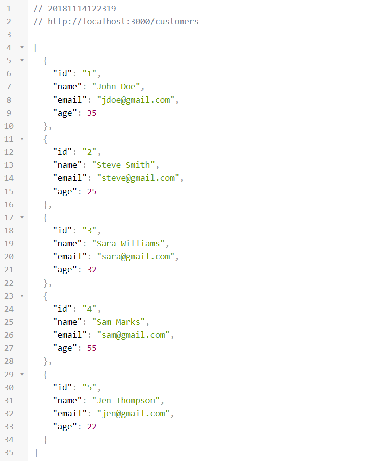
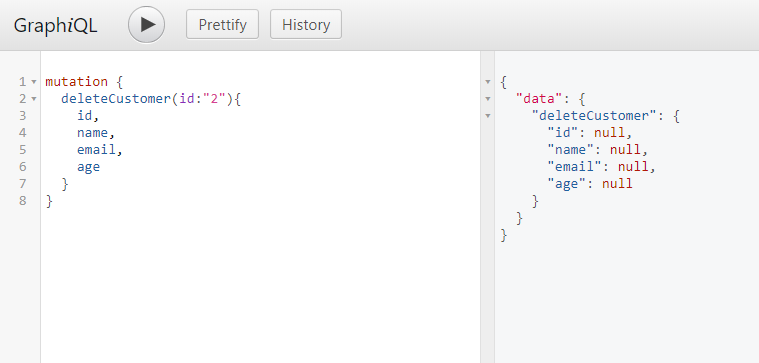

# GraphQL_Server

GraphQL Server example using GraphQL, Express, Axios & JSON Server

### JSON Server

___

### Mutations
* SELECT all Customers Query

* SELECT Customer Query

* Delete Mutation

* Insert Mutation

* Update Mutation
